# Mobile Toolkit

> **Android Studio-style mobile & emulator developer controls inside VS Code's debug toolbar and sidebar.** Easily manage Dark Mode, Navigation Mode, Accessibility (TalkBack & Select to Speak), Display & Font Scaling, Layout Bounds, and Screen Recording directly from your editor.

---

## Screenshots

<br>

<p align="center">
  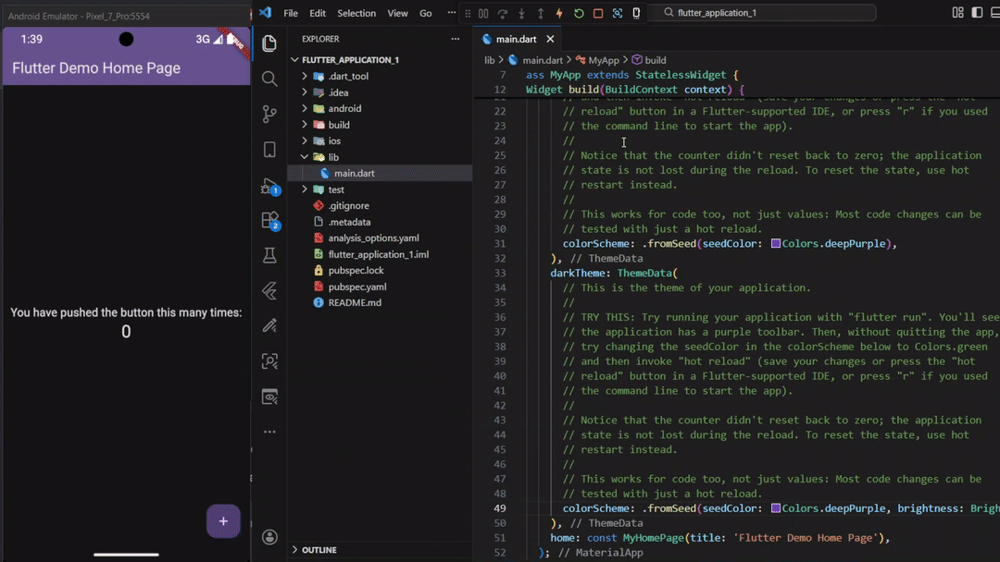
  &nbsp;&nbsp;
  
</p>

<br>

---

## What the Extension Does

When developing mobile applications with **Flutter**, **React Native**, or **Android Native** in VS Code, toggling device settings (like dark mode, font scale, or layout bounds) normally requires opening Android Studio's Extended Controls, digging through Android OS Settings menus, or executing manual ADB CLI commands.

**Mobile Toolkit** brings these essential controls right into VS Code:

- A dedicated **Sidebar Panel** in the Activity Bar for visual management.
- Quick-action buttons integrated into VS Code's **Debug Toolbar**.
- Command Palette integration for keyboard shortcuts.

---

## Features & Demos

| Feature                    | Details                                                                                                              | Preview                                                                                                                                         |
| -------------------------- | -------------------------------------------------------------------------------------------------------------------- | ----------------------------------------------------------------------------------------------------------------------------------------------- |
| **Sidebar Control Panel**  | Full control webview interface in the Activity Bar. Click on the device name bar at the top to switch active devices | 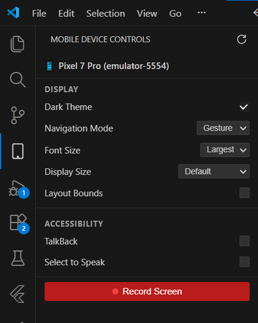                                                             |
| **Debug Toolbar Actions**  | Configurable quick-action icons directly on the debug bar                                                            | 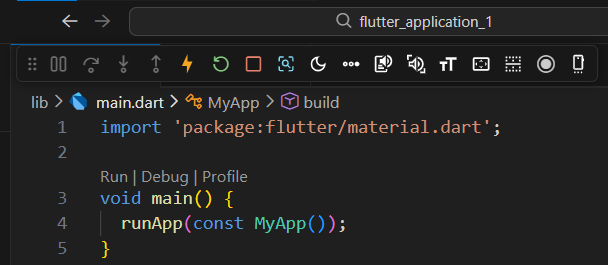                                                                     |
| **Dark Mode Toggle**       | Toggle system-wide Light and Dark themes instantly                                                                   | 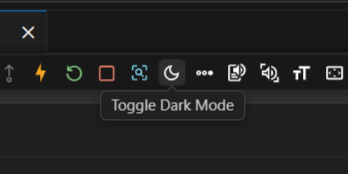                                                                               |
| **Navigation Mode**        | Switch between Gesture, 2-Button, and 3-Button navigation styles                                                     | 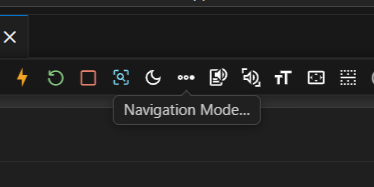                                                                   |
| **Font & Display Scaling** | Adjust font sizes (Small to Largest) and display density (280–560 DPI)                                               | 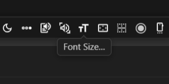 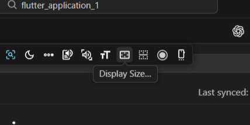 |
| **Accessibility Tools**    | Toggle TalkBack screen reader and Select to Speak accessibility services                                             | 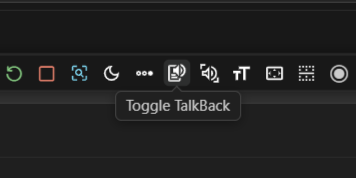 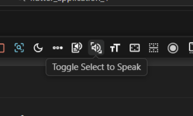   |
| **Layout Bounds**          | Show or hide view boundary borders for pixel-perfect UI debugging                                                    | 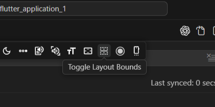                                                                       |
| **Screen Recording**       | Record device screen (up to 3 minutes) with optional auto-open in editor                                             | 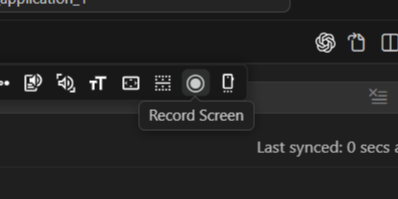                                                                 |
| **Multi-Device Support**   | Auto-detect multiple devices; click the device name header at the top of the sidebar view to switch instantly        | 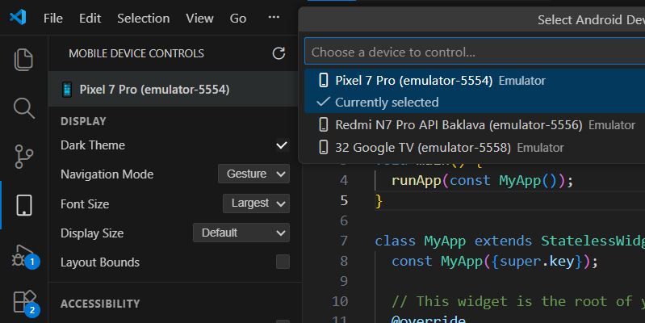                                                                   |

---

## Installation Instructions

### Prerequisites

1. **VS Code** 1.90.0 or higher.
2. **Android SDK Platform-Tools** (`adb` must be installed and added to your system `PATH`).
   - Test by running `adb version` in your terminal.

### Installing from VS Code Marketplace

1. Open VS Code.
2. Go to **Extensions** (`Ctrl+Shift+X` / `Cmd+Shift+X`).
3. Search for **Mobile Toolkit**.
4. Click **Install**.

### Installing from VSIX Package

```bash
code --install-extension mobile-toolkit-0.0.1.vsix
```

---

## Usage Examples

### 1. Activity Bar Sidebar

1. Click the **Mobile Toolkit** icon on the VS Code Activity Bar (left sidebar).
2. Connected Android emulators/devices will automatically appear.
3. Click on the device name header (e.g. `Pixel 7 Pro (emulator-5554)`) at the top of the sidebar view anytime to change the active device.
4. Use the toggle buttons, dropdowns, and screen recording controls to manage the device in real-time.

### 2. Debug Toolbar Quick Actions

When you start a debug session (e.g., `Flutter: Run & Debug` or `React Native`):

1. The **Mobile Toolkit** icon appears on the floating Debug Toolbar.
2. Click it to bring focus to the device controls.
3. Enable additional quick-action icons (e.g., Dark Mode, Record Screen) via settings to customize your debug toolbar.

### 3. Command Palette

Press `Ctrl+Shift+P` (or `Cmd+Shift+P` on macOS) and type **Mobile Toolkit**:

- `Select Android Device`
- `Refresh Device List`
- `Toggle Dark Mode`
- `Navigation Mode…`
- `Toggle TalkBack`
- `Toggle Select to Speak`
- `Font Size…`
- `Display Size…`
- `Toggle Layout Bounds`
- `Record Screen`

---

## Configuration Options

Customize settings in **Settings** (`Ctrl+,` / `Cmd+,`) under **Mobile Toolkit** (`mobile-toolkit.*`).

| Setting                   | Type      | Default | Description                                                                                  |
| ------------------------- | --------- | ------- | -------------------------------------------------------------------------------------------- |
| `autoDetectDevices`       | `boolean` | `true`  | Automatically detect and monitor connected Android devices via ADB polling.                  |
| `showOpenControlsButton`  | `boolean` | `true`  | Show the Open Device Controls button on the debug toolbar when a device is connected.        |
| `showDarkModeButton`      | `boolean` | `false` | Show a Dark Mode toggle button directly on the debug toolbar.                                |
| `showNavModeButton`       | `boolean` | `false` | Show a Navigation Mode (Gesture vs 3-Button) picker button on the debug toolbar.             |
| `showTalkBackButton`      | `boolean` | `false` | Show a TalkBack accessibility toggle button on the debug toolbar.                            |
| `showSelectToSpeakButton` | `boolean` | `false` | Show a Select to Speak accessibility toggle button on the debug toolbar.                     |
| `showFontSizeButton`      | `boolean` | `false` | Show a Font Size picker button on the debug toolbar.                                         |
| `showDisplaySizeButton`   | `boolean` | `false` | Show a Display Size picker button on the debug toolbar.                                      |
| `showLayoutBoundsButton`  | `boolean` | `false` | Show a Layout Bounds toggle button on the debug toolbar.                                     |
| `showRecordButton`        | `boolean` | `false` | Show a Screen Recording button on the debug toolbar.                                         |
| `openRecordingAfterSave`  | `boolean` | `true`  | Automatically open saved screen recordings in the VS Code media viewer.                      |
| `outputDirectory`         | `string`  | `""`    | Directory to save screen recordings. Defaults to `emulator-captures/` in the workspace root. |

### Example `settings.json`

```json
{
  "mobile-toolkit.autoDetectDevices": true,
  "mobile-toolkit.showOpenControlsButton": true,
  "mobile-toolkit.showDarkModeButton": true,
  "mobile-toolkit.showNavModeButton": true,
  "mobile-toolkit.showLayoutBoundsButton": true,
  "mobile-toolkit.showRecordButton": true,
  "mobile-toolkit.openRecordingAfterSave": true,
  "mobile-toolkit.outputDirectory": "captures/"
}
```

---

## Known Issues & Troubleshooting

- **"ADB command failed" / "ADB not found"**:  
  Ensure `adb` is added to your environment variables (`PATH`). On Windows, verify `%ANDROID_HOME%\platform-tools` is in System Environment Variables.
- **Screen Recording limit**:  
  Android OS restricts `screenrecord` commands to a maximum duration of 3 minutes per recording.

---

## Contribution Guidelines

Contributions, bug reports, and feature requests are welcome!

### Local Development Setup

1. **Clone the repository**:

   ```bash
   git clone https://github.com/antonyaiwin/mobile-toolkit-vs-code-ext.git
   cd mobile-toolkit-vs-code-ext
   ```

2. **Install dependencies**:

   ```bash
   npm install
   ```

3. **Start Watch Mode**:

   ```bash
   npm run watch
   ```

4. **Launch Extension in Debugger**:
   - Press `F5` in VS Code to open an **Extension Development Host** window.

## License

This project is licensed under the [MIT License](LICENSE).
